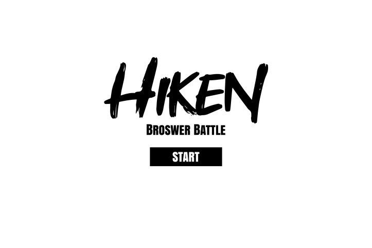
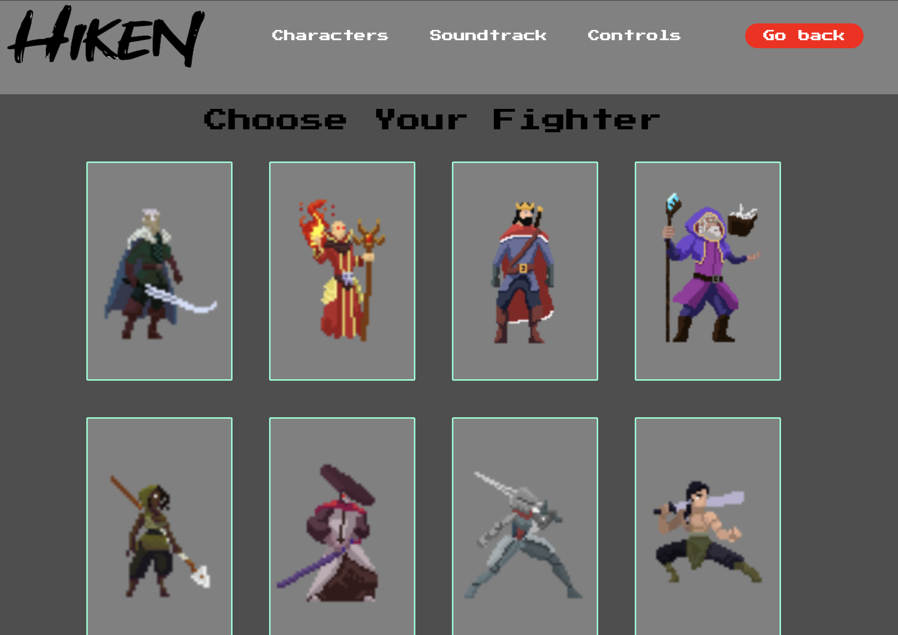
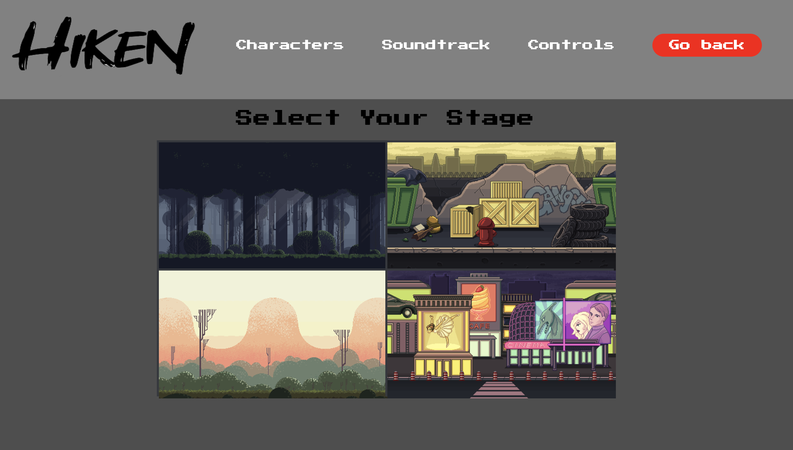
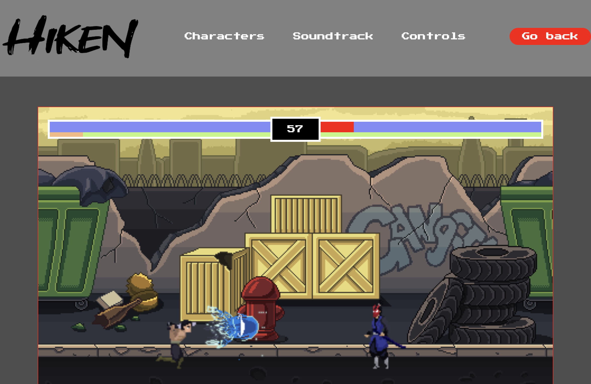
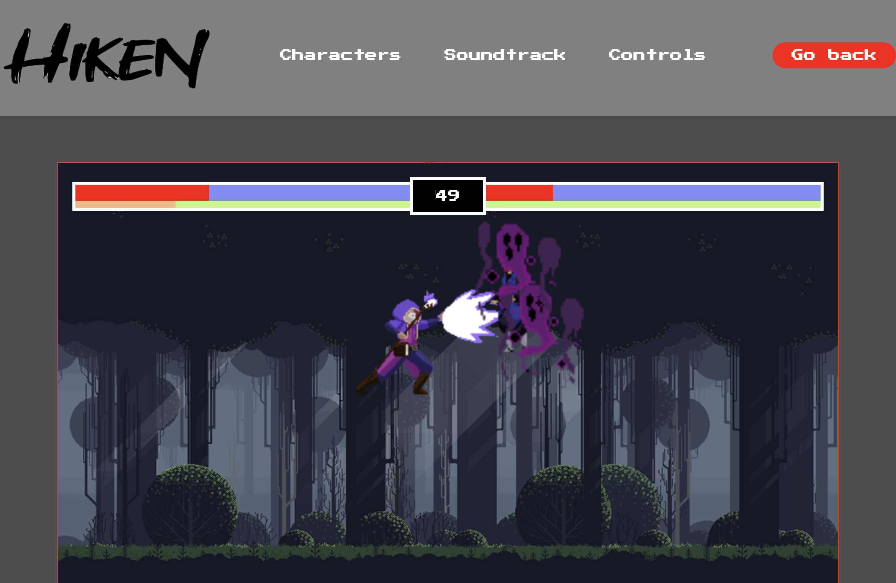

# Hiken - Browser Battle
Group 5's submission for CPSC 362, Group Project

# Group Information
* Names: Spencer Price, Joji Thomas, Ethan Marcelino, Edwin Peraza, Nghia Phan
* Emails: spencerprice@csu.fullerton.edu, jthomas@csu.fullerton.edu, emarcelino@csu.fullerton.edu, edwinperaza@csu.fullerton.edu, ptnghia@csu.fullerton.edu
* Roles: Product Ownder, Scrum Master, Developer 1, QA Tester, Developer 2

# Instructions
This app will allow users to play a browser based 2d fighting game.

# Controls
User will use a standard qwerty keyboard to control the movement and attacks of
the characters. The 'W' 'A' 'S' 'D' keys will control the players movement in
the arena. ,

### Player
- For player (left),
- [x] 'Space Bar' to attack, to be continued...

- For playerspecial attacks
- [x] healing effect (key x)
- [x] melee attack (key c)
- [x] ranged attack (key z)

### Enemy
- For enemy (right) (automatic by default),
- [x] 'Enter' to attack
- For special attacks
- [x] healing effect (arrow down)
- [x] fireball (key p)

# Attack Simulation:
- Currently in testing ...
- Attack simulation function named simulateAttack() can be found in [click here](./js/enemy.js)
- The function uses random number to simulate attack, it can be adjusted accordingly to make game harder.
- The larger the range of the if conditions, the more probability the actions will happen
Ex: increasing the range of number to make enemy launch more attacks

# Preview
- To be updated:

