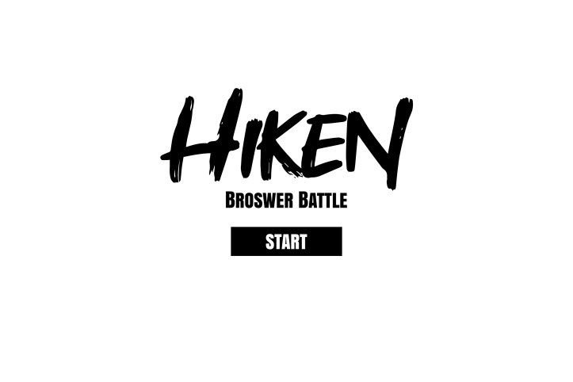
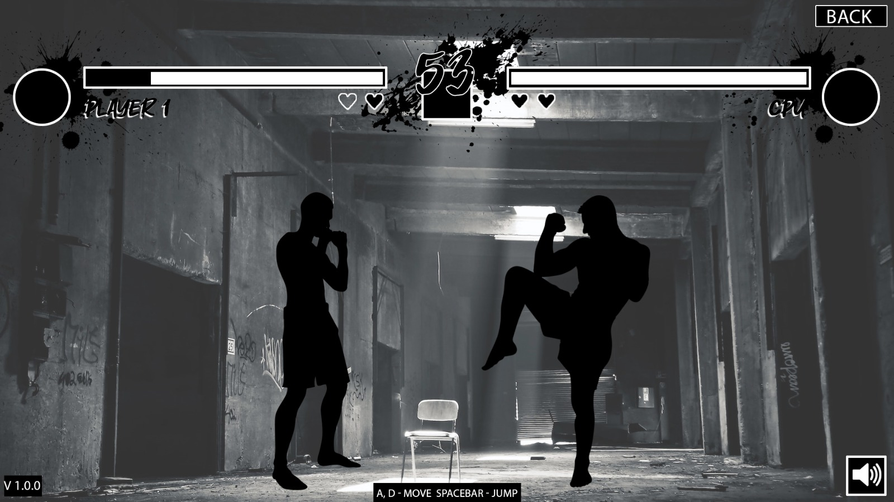
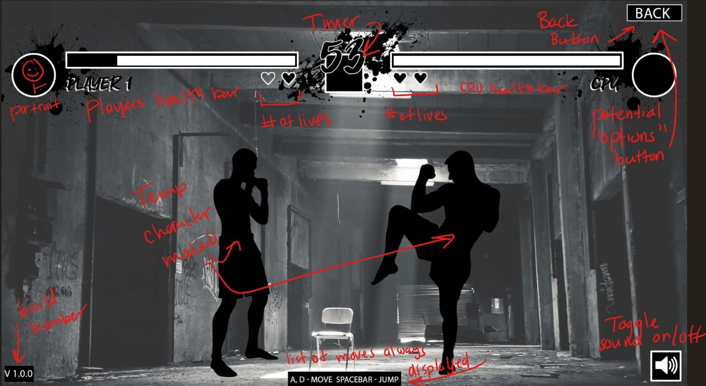

# Hiken - Browser Battle
Group 5's submission for CPSC 362, Group Project

# Group Information
* Names: Spencer Price, Joji Thomas, Ethan Marcelino, Edwin Peraza, Nghia Phan
* Emails: spencerprice@csu.fullerton.edu, jthomas@csu.fullerton.edu, emarcelino@csu.fullerton.edu, edwinperaza@csu.fullerton.edu, ptnghia@csu.fullerton.edu
* Roles: Product Ownder, Scrum Master, Developer 1, QA Tester, Developer 2

# Instructions
This app will allow users to play a browser based 2d fighting game.

# Controls
User will use a standard qwerty keyboard to control the movement and attacks of
the characters. The 'W' 'A' 'S' 'D' keys will control the players movement in
the arena. 'Space Bar' to attack, to be continued...

